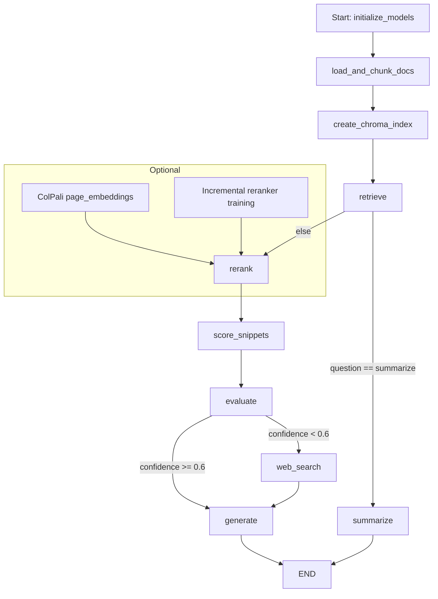

# Agentic RAG — Multi‑PDF RAG Chatbot

[](LICENSE)  

> **Agentic RAG** is an advanced, production-ready Streamlit application for Retrieval-Augmented Generation (RAG) over multiple PDF documents. It supports multi-user authentication, persistent storage, active learning (feedback → incremental reranker training), optional multimodal ColPali/ColQwen hybrid reranking, streaming LLM output, and flexible deployment.


---

## 🚀 Highlights (at-a-glance)

* Upload many PDFs and ask natural-language questions about them.
* Persistent multi-user accounts (SQLite) + per-user storage for files and models.
* Chroma vector index for document retrieval (persisted per-user + file-hash keyed cache).
* Optional OCR fallback for image-only PDF pages via Tesseract.
* Optional ColPali / ColQwen page-image embeddings to hybrid re-rank visual pages.

* Active learning: quick feedback buttons (Relevant / Not relevant) which are stored and can be used to incrementally train a scikit-learn reranker (SGDClassifier).
* Streaming answer generation (LLM streaming or chunked reveal) with confidence scoring of retrieved snippets.
* Rate-limiting per-user, file sanitization, model upload management and download/export tools.


## ✅ Features (detailed)

### Authentication & multi-user persistence

* Register & login users (SQLite `users` table). Passwords are PBKDF2‑SHA256 hashed with a per-user salt.
* Persisted chats (`chats` table) and feedback (`feedback` table) per-user.
* Per-user file storage (`files` table) with sanitized filenames and file-hash based names.

### Uploads & PDF ingestion

* Upload multiple PDF files via Streamlit sidebar.
* File size guard (env `AGENTIC_RAG_MAX_UPLOAD_BYTES`, default 10MB) to prevent excessive uploads.
* PDF parsing via `PyPDF2`; if a page has no extractable text and Tesseract is available, OCR is attempted.
* Text chunking with optional tiktoken-based token-safe chunking (if `tiktoken` installed) or character-based chunking fallback.

### Vector index & retrieval

* Chroma vector store created per-user+file-hash and optionally persisted to disk (Chroma `persist_directory` configured under `STORAGE_ROOT`).
* Embedding provider: GoogleGenerativeAIEmbeddings (Gemini) by default, but code uses abstraction so alternative embedding models can be injected.
* Retriever fetches `k` relevant chunks (configurable in the retriever call).

### Reranking & Active Learning

* Two-stage re-ranking:

  1. Optional learned reranker (SGDClassifier) trained on saved `feedback` examples. Embeddings of snippets are cached and used as features.
  2. Optional ColPali hybrid re-scoring that computes page-image similarity and blends it with existing scores (70% image sim + 30% text score by default).
* Quick inline feedback buttons in the UI — every label is stored and can trigger incremental training.
* Incremental training persists models under per-user `models/` dir; last trained model stored as `reranker_sgd.joblib`.

### LLM orchestration & scoring

* Uses `ChatGoogleGenerativeAI` (Gemini) as primary LLM and `GoogleGenerativeAIEmbeddings` for embeddings — set `GEMINI_API_KEY` via environment or Streamlit secrets.
* Scoring nodes evaluate snippet-level relevance using the LLM (`score_snippets_node`) and aggregate confidence (`evaluate_node`). These confidence values can gate whether to answer or fallback to web search.
* Streaming answer generation if the LLM supports streaming. Otherwise fallback to chunked reveal for better UX.

### Web search fallback

* Integrates Tavily search as an optional web augment (`TAVILY_API_KEY`) for queries where confidence is low.

### Tools & utilities

* Export chat history & feedback as JSON from the UI.
* Upload / download reranker models for portability.
* Simple per-minute rate limiter (configurable via `AGENTIC_RAG_RATE_LIMIT_N`).

---

## 🛠️ Prerequisites

* Python 3.8+
* A modern machine or cloud instance (if using ColPali/ColQwen, GPU is recommended)
* Google Gemini API key (set `GEMINI_API_KEY`) if you plan to use the default LLM & embeddings.
* Tavily API key (optional) for web search integration: set `TAVILY_API_KEY`.
* Optional extras:

  * `pytesseract` + `tesseract` binary for OCR fallbacks.
  * `torch`, `pdf2image` and `colpali_engine` for ColPali/ColQwen image embeddings.
  * `scikit-learn` + `joblib` to enable reranker training and model persistence.
  * `tiktoken` for token-accurate chunking.

---

## ⚙️ Environment variables / .env

Create a `.env` (or set environment variables) with at least:

```
GEMINI_API_KEY=your_gemini_key_here
TAVILY_API_KEY=your_tavily_key_here
AGENTIC_RAG_DB_PATH=/path/to/agentic_rag.db
AGENTIC_RAG_STORAGE=/path/to/storage_root
AGENTIC_RAG_MAX_UPLOAD_BYTES=10485760   # default 10 MB
AGENTIC_RAG_RATE_LIMIT_N=30
```

> The app also reads Streamlit secrets (`st.secrets`) if present.

---

## 💻 Installation (local)

```bash
# recommended: create venv
python -m venv .venv
source .venv/bin/activate      # mac / linux
.venv\Scripts\activate       # windows

pip install -r requirements.txt
# or install core deps manually
pip install streamlit pyPDF2 chromadb google-generativeai langgraph langchain-community
# optional:
pip install scikit-learn joblib tiktoken pytesseract pdf2image torch
```

## ▶️ Running the app

```bash
streamlit run app.py
```

Open the URL printed by Streamlit (usually `http://localhost:8501`).

---

## 🧭 Quickstart — Typical workflow

1. Start the app with `streamlit run app.py`.
2. Register an account (sidebar) and Login.
3. Upload one or more PDFs using the sidebar uploader.
4. Ask a question in the main pane (or click *Summarize documents*).
5. View streamed answer and the best retrieved snippet with provenance (filename / page / chunk).
6. Use **Mark Relevant** or **Mark Not Relevant** to give feedback that improves the reranker over time.
7. Optional: Upload a trained reranker model via the sidebar or let the app train one incrementally from feedback.

---

## 🔁 Reranker training (incremental)

* Feedback rows are stored in SQLite `feedback` table for each user.
* `train_reranker_incremental(user_id)` will:

  1. Load saved feedback rows for the user.
  2. Embed snippet texts (cached under `STORAGE_ROOT/user_<id>/emb_cache/<file_hash>`).
  3. Train or partial\_fit an `SGDClassifier` (log loss) and persist both a timestamped and stable file under `user_<id>/models/`.
* UI exposes a **Train reranker from feedback** button to trigger this.

---

## 🖼️ ColPali / ColQwen hybrid reranking (experimental)

* If `colpali_engine` + `torch` + `pdf2image` are installed, the app can compute page-image embeddings and cache them per-file + user.
* The hybrid score blends image similarity (70%) with the text score (30%) to re-rank snippets where images matter (for diagrams, screenshots, forms).
* Flag `Enable ColPali/ColQwen hybrid rerank` in the sidebar to attempt building the index (best-effort, cached).

---

## 🔒 Security & operational notes

* Passwords are hashed with PBKDF2 + per-user salt (200,000 iterations).
* Filenames are sanitized to avoid arbitrary path writes. File content is written only under `STORAGE_ROOT`.
* Rate limiting prevents abuse (per minute). Set `AGENTIC_RAG_RATE_LIMIT_N` to tune.
* Avoid running with `STORAGE_ROOT` on ephemeral container storage unless you accept that user data will be lost on restart; persist to a mounted volume when deploying.
* If deploying publicly, secure the Streamlit instance (reverse proxy, TLS) and protect the DB file; consider adding OAuth for production-grade auth.

---

## 📈 Architecture / Workflow Diagram

Below is a high-level mermaid workflow that matches the `StateGraph` pipeline in the code:



> This mirrors the graph created by `workflow = StateGraph(State)` in the code and the conditional routing after retrieval and evaluation.

---

## 📌 UI Walkthrough & Controls

**Sidebar**

* Account: Register / Login (Confirm Auth)
* Upload PDF(s) (accepts multiple files)
* Model save dir
* Reranker model upload / load / delete (if scikit-learn & joblib are installed)
* Manual feedback expander (paste snippet + label)
* Enable ColPali / ColQwen hybrid rerank toggle
* Train reranker from feedback button
* Summarize documents button

**Main pane**

* Left column: Chat history, exports, last trained reranker download
* Right column: Ask question input, *Get Answer* button, streamed answer and provenance, feedback buttons per snippet

---

## 🧪 Troubleshooting & Tips

* **LLM API key missing**: If `GEMINI_API_KEY` is not set you will see an error — set it in your environment or `st.secrets` and restart.
* **Chroma errors**: Ensure Chroma / dependencies are installed; check filesystem permissions for the `STORAGE_ROOT` persist directory.
* **Reranker not training**: Install `scikit-learn` and `joblib`; verify `feedback` table has rows for the user.
* **OCR not working**: Install `tesseract` binary and `pytesseract`; make sure `pdf2image` is present.
* **ColPali attempt fails**: This path is best-effort and will be disabled if `torch`/`colpali_engine` or `pdf2image` aren't available. GPU recommended for Col models.

---


## 🤝 Contributing

Contributions are welcome. Suggested improvements:

* Extracting `app.py` into modular packages (`ingest`, `indexing`, `ui`, `auth`).
* Add OAuth2 / Google sign-in for production authentication.
* Add tests for DB migrations and node functions.
* Add a Helm chart / k8s example for production deployment.

---

## 📝 License

This project is provided under the **MIT License**. See `LICENSE` for details.

---


