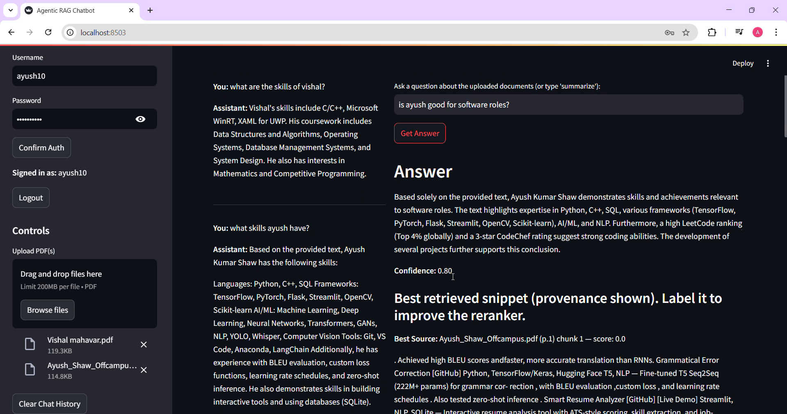

# ⚡ Agentic RAG — Multi‑PDF RAG Chatbot

[](LICENSE)    

<p align="center">
  <a href="https://drive.google.com/file/d/1CkHzVcIQQrCE1JeM5Q8hdNra_4XG9uGm/view?usp=sharing" target="_blank">
    
  </a>
</p>

<p align="center"><strong>⬆️ Click the badge above to watch the full end‑to‑end demo video</strong></p>

> **Agentic RAG** is a **production-ready Retrieval-Augmented Generation (RAG) platform** built with **Streamlit**. It supports **multi‑PDF ingestion**, **multi‑user authentication**, **active learning via feedback → incremental reranker training**, **hybrid ColPali/ColQwen visual reranking**, **persistent storage**, and **streaming LLM responses**.

---

## 📚 Table of Contents

* [Why Agentic RAG](#-why-agentic-rag)
* [Feature Highlights](#-feature-highlights)
* [Architecture](#-architecture)
* [Prerequisites](#-prerequisites)
* [Environment Variables](#-environment-variables--env)
* [Installation](#-installation)
* [Run the App](#️-run-the-app)
* [Quickstart Workflow](#-quickstart-workflow)
* [Incremental Reranker Training](#-incremental-reranker-training)
* [ColPali/ColQwen Hybrid Rerank (Experimental)](#-colpalicolqwen-hybrid-rerank-experimental)
* [Security & Operations](#-security--operations)
* [UI Overview](#-ui-overview)
* [Screenshots](#-screenshots)
* [Troubleshooting](#-troubleshooting)
* [Roadmap](#-roadmap)
* [Contributing](#-contributing)
* [License](#-license)

---

## 💡 Why Agentic RAG

* 🔍 **Ask questions across many PDFs** in natural language.
* 👤 **Multi-user** accounts with per-user persistent storage (SQLite + file sandboxing).
* 🧠 **Active learning:** feedback buttons store labels and **incrementally train** a lightweight reranker (SGDClassifier).
* 🖼️ **Hybrid retrieval:** text + **ColPali/ColQwen** page-image similarity for visual documents.
* ⚡ **Streaming answers** + snippet‑level **confidence scoring** and provenance.
* 🌐 **Web search fallback** (Tavily) when document confidence is low.
* 🛡️ **Operational safety:** password hashing (PBKDF2), file sanitization, rate limiting, and export tools.

---

## ✨ Feature Highlights

* Register/login (SQLite `users` table), PBKDF2‑SHA256 with per‑user salt.
* Persisted chats (`chats`) and feedback (`feedback`) per user.
* Per‑user file registry (`files`) with sanitized, content-hash filenames.
* Multi‑PDF upload with OCR fallback (Tesseract + pytesseract if available).
* Chroma vector store, Gemini embeddings by default.
* Two-stage reranker + optional ColPali/ColQwen hybrid visual rerank.
* Streaming LLM responses and provenance.

---

## 🖼 Screenshots (only **Rag_Chat1** — shown below)

> The README now embeds a single screenshot: `Screenshots/Rag_Chat1.png`. Make sure this file path exists in your repository.

<p align="center">
  
</p>

*Caption:* Main chat pane — conversation, snippet provenance, and feedback controls.

---

## 🛠 Prerequisites

* **Python 3.8+**
* **Gemini API key** for default LLM & embeddings
* Optional extras: `pytesseract` + Tesseract, `torch`, `pdf2image`, `scikit-learn`, `joblib`, `tiktoken`

---

## ⚙ Environment Variables / `.env`

```env
GEMINI_API_KEY=your_gemini_key_here
TAVILY_API_KEY=your_tavily_key_here
AGENTIC_RAG_DB_PATH=./agentic_rag.db
AGENTIC_RAG_STORAGE=./storage_root
AGENTIC_RAG_MAX_UPLOAD_BYTES=10485760   # default 10 MB
AGENTIC_RAG_RATE_LIMIT_N=30
```

---

## 💻 Installation

```bash
# create and activate venv
python -m venv .venv
# mac/linux
# source .venv/bin/activate
# windows
# .venv/Scripts/activate

pip install -r requirements.txt
```

---

## ▶️ Run the App

```bash
streamlit run app.py
```

Open the URL shown in your terminal (usually `http://localhost:8501`).

---

## 🧭 Quickstart Workflow

1. Start the app with `streamlit run app.py`.
2. Register / Login via the sidebar.
3. Upload PDFs.
4. Ask a question or Summarize documents.
5. Provide snippet feedback and train the reranker to improve relevance.

---

## 🔁 Incremental Reranker Training

Feedback rows are stored per user; call `train_reranker_incremental(user_id)` or use the sidebar control to `partial_fit` an SGDClassifier and persist models under `STORAGE_ROOT/user_<id>/models/`.

---

## 🔒 Security & Operations

* PBKDF2 password hashing, sanitized filenames, confined writes under `STORAGE_ROOT`.
* Rate limiting and basic input sanitization.
* For production: reverse proxy (nginx), TLS, and volume protection.

---

## 🧪 Troubleshooting

* Missing LLM key → set `GEMINI_API_KEY` and restart Streamlit.
* Chroma issues → verify `AGENTIC_RAG_STORAGE` permissions.
* OCR failures → install Tesseract and `pytesseract`.

---

## 🗺 Roadmap

* Split `app.py` into packages, add OAuth, unit tests, k8s manifests, and usage analytics.

---

## 🤝 Contributing

Contributions welcome — open an issue or PR with clear steps to reproduce.

---

## 📝 License

MIT — see `LICENSE`.

---

*Notes:* If `Screenshots/Rag_Chat1.png` has a different filename or path, update the image path in this README. The canvas now contains the full, updated README with only the requested screenshot embedded.
