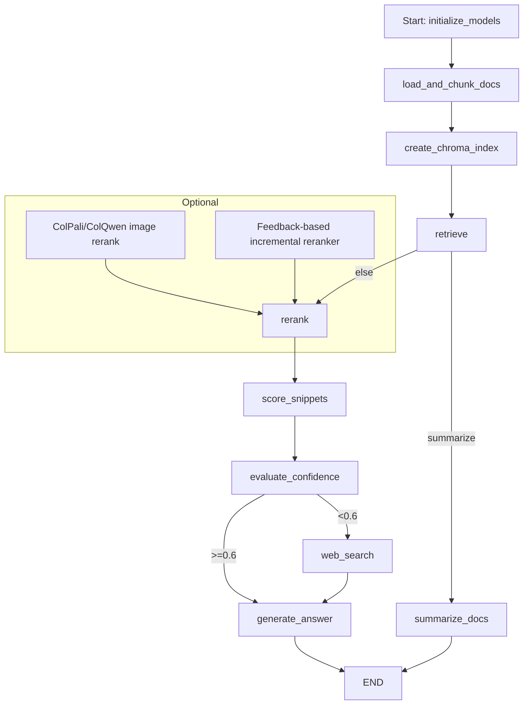

# ⚡ Agentic RAG — Multi‑PDF RAG Chatbot

[](LICENSE)    

> **Agentic RAG** is a **production-ready Retrieval-Augmented Generation (RAG) platform** built with **Streamlit**. It supports **multi‑PDF ingestion**, **multi‑user authentication**, **active learning via feedback → incremental reranker training**, **hybrid ColPali/ColQwen visual reranking**, **persistent storage**, and **streaming LLM responses**.

🎥 **Live Demo (Video):** [Watch on Google Drive](https://drive.google.com/file/d/1CkHzVcIQQrCE1JeM5Q8hdNra_4XG9uGm/view?usp=sharing)

---

## 📚 Table of Contents

* [Why Agentic RAG](#-why-agentic-rag)
* [Feature Highlights](#-feature-highlights)
* [Architecture](#-architecture)
* [Prerequisites](#-prerequisites)
* [Environment Variables](#-environment-variables--env)
* [Installation](#-installation)
* [Run the App](#️-run-the-app)
* [Quickstart Workflow](#-quickstart-workflow)
* [Incremental Reranker Training](#-incremental-reranker-training)
* [ColPali/ColQwen Hybrid Rerank (Experimental)](#-colpalicolqwen-hybrid-rerank-experimental)
* [Security & Operations](#-security--operations)
* [UI Overview](#-ui-overview)
* [Troubleshooting](#-troubleshooting)
* [Roadmap](#-roadmap)
* [Contributing](#-contributing)
* [License](#-license)

---

## 💡 Why Agentic RAG

* 🔍 **Ask questions across many PDFs** in natural language.
* 👤 **Multi-user** accounts with per-user persistent storage (SQLite + file sandboxing).
* 🧠 **Active learning:** feedback buttons store labels and **incrementally train** a lightweight reranker (SGDClassifier).
* 🖼️ **Hybrid retrieval:** text + **ColPali/ColQwen** page-image similarity for visual documents.
* ⚡ **Streaming answers** + snippet‑level **confidence scoring** and provenance.
* 🌐 **Web search fallback** (Tavily) when document confidence is low.
* 🛡️ **Operational safety:** password hashing (PBKDF2), file sanitization, rate limiting, and export tools.

---

## ✨ Feature Highlights

### Authentication & Persistence

* Register/login (SQLite `users` table), PBKDF2‑SHA256 with per‑user salt.
* Persisted chats (`chats`) and feedback (`feedback`) per user.
* Per‑user file registry (`files`) with sanitized, content-hash filenames.

### Uploads & Ingestion

* Multi‑PDF upload via sidebar.
* Size guard via `AGENTIC_RAG_MAX_UPLOAD_BYTES` (default **10 MB**).
* Parsing with **PyPDF2**; OCR fallback (if **Tesseract + pytesseract** present).
* Token‑aware chunking via **tiktoken** (fallback to character chunking).

### Vector Index & Retrieval

* **Chroma** vector store, per user + file‑hash cache, optional disk persistence under `STORAGE_ROOT`.
* Embeddings via **GoogleGenerativeAIEmbeddings (Gemini)** (easily swappable).
* Configurable top‑k retrieval.

### Reranking & Active Learning

* Two-stage rerank:

  1. **Learned reranker** (SGDClassifier) trained incrementally on feedback (embeddings cached).
  2. **Hybrid visual rerank** (ColPali/ColQwen page-image embeddings) blending \~70% image sim + 30% text score.
* Inline **Relevant / Not Relevant** feedback buttons persist labels and can trigger training.

### LLM Orchestration & Scoring

* Primary LLM: **ChatGoogleGenerativeAI (Gemini)**; embeddings via **GoogleGenerativeAIEmbeddings**.
* **score\_snippets → evaluate → generate** pipeline with confidence gating.
* Streaming answers (where LLM supports) or chunked reveal fallback.

### Web Search Fallback

* Optional **Tavily** integration (`TAVILY_API_KEY`) when evaluation confidence is low.

---

## 🧱 Architecture



---

## 🛠 Prerequisites

* **Python 3.8+**
* **Gemini API key** for default LLM & embeddings
* Optional extras:

  * `pytesseract` + **Tesseract** binary for OCR
  * `torch`, `pdf2image`, `colpali_engine` for ColPali/ColQwen image embeddings (GPU recommended)
  * `scikit-learn` + `joblib` for reranker training
  * `tiktoken` for token‑accurate chunking
  * **Tavily API key** for web search fallback

---

## ⚙ Environment Variables / `.env`

Create a `.env` (or set env vars) with at least:

```env
GEMINI_API_KEY=your_gemini_key_here
TAVILY_API_KEY=your_tavily_key_here
AGENTIC_RAG_DB_PATH=./agentic_rag.db
AGENTIC_RAG_STORAGE=./storage_root
AGENTIC_RAG_MAX_UPLOAD_BYTES=10485760   # default 10 MB
AGENTIC_RAG_RATE_LIMIT_N=30
```

> The app also reads `st.secrets` if present.

---

## 💻 Installation

```bash
# 1) Create and activate a virtual environment
python -m venv .venv
# mac/linux	source .venv/bin/activate
# windows	.venv\Scripts\activate

# 2) Install dependencies
pip install -r requirements.txt
# or install core deps manually
pip install streamlit PyPDF2 chromadb google-generativeai langgraph langchain-community
# optional extras
pip install scikit-learn joblib tiktoken pytesseract pdf2image torch
```

---

## ▶️ Run the App

```bash
streamlit run app.py
```

Then open the URL shown in your terminal (usually `http://localhost:8501`).

---

## 🧭 Quickstart Workflow

1. **Start** the app: `streamlit run app.py`.
2. **Register** an account (sidebar) and **Login**.
3. **Upload** one or more PDFs.
4. **Ask** a question (or click **Summarize documents**).
5. **Read** the streamed answer + provenance (filename / page / chunk).
6. **Label** snippets (Relevant / Not Relevant).
7. **Train** the reranker from feedback (sidebar button) and improve results.

---

## 🔁 Incremental Reranker Training

* Feedback rows are stored per user in the `feedback` table.
* `train_reranker_incremental(user_id)` will:

  1. Load feedback rows for the user.
  2. Embed snippet texts (cached under `STORAGE_ROOT/user_<id>/emb_cache/<file_hash>`).
  3. Train or `partial_fit` an **SGDClassifier** (log loss) and persist models under `user_<id>/models/` (timestamped + `reranker_sgd.joblib`).
* The UI exposes **Train reranker from feedback** to trigger this.

---

## 🖼 ColPali/ColQwen Hybrid Rerank (Experimental)

* With `colpali_engine` + `torch` + `pdf2image` installed, the app computes page‑image embeddings and caches them per file + user.
* Hybrid score: **70% image similarity + 30% text score** (configurable) to boost diagram/table‑heavy pages.
* Toggle **Enable ColPali/ColQwen hybrid rerank** in the sidebar.

---

## 🔒 Security & Operations

* Passwords hashed with **PBKDF2** + per‑user salt (200,000 iterations).
* Filenames sanitized; all writes confined under `STORAGE_ROOT`.
* **Rate limiting** per minute via `AGENTIC_RAG_RATE_LIMIT_N`.
* For public deployments: put Streamlit behind a **reverse proxy**, enable **TLS**, protect the DB volume, and consider **OAuth**.

---

## 🧭 UI Overview

**Sidebar**

* Register / Login
* Upload PDFs (multi)
* Model save directory
* Reranker: upload / load / delete
* Manual feedback expander (paste snippet + label)
* Enable ColPali/ColQwen hybrid rerank
* Train reranker from feedback
* Summarize documents

**Main Pane**

* Chat history, exports, last trained reranker download
* Question input + **Get Answer**
* Streamed answer + provenance
* Feedback buttons per snippet

---

## 🧪 Troubleshooting

* **LLM API key missing** → set `GEMINI_API_KEY` in `.env` or `st.secrets` and restart.
* **Chroma errors** → verify install and file permissions for `AGENTIC_RAG_STORAGE`.
* **Reranker not training** → ensure `scikit-learn` + `joblib` are installed and `feedback` has rows.
* **OCR not working** → install **Tesseract** and `pytesseract`; ensure `pdf2image` is present.
* **ColPali failures** → requires `torch`, `pdf2image`, and `colpali_engine`; GPU strongly recommended.

---

## 🗺 Roadmap

* Extract `app.py` into modular packages (`ingest`, `indexing`, `auth`, `ui`).
* OAuth2 / Google sign‑in for production deployments.
* Unit tests for DB migrations and graph node functions.
* Helm chart / k8s manifests for scalable deployments.
* Add configurable reranker blends and UI analytics.

---

## 🤝 Contributing

Contributions welcome! Please open an issue or PR with a clear description and repro steps.

---

## 📝 License

This project is provided under the **MIT License**. See [`LICENSE`](LICENSE) for details.
