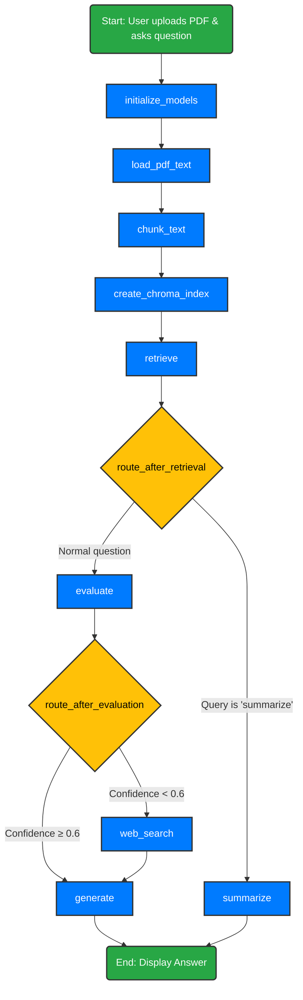

# Agentic RAG — Multi-PDF RAG Chatbot

**Agentic RAG** converts a collection of PDFs into an interactive, retrieval-augmented chatbot. Users upload PDFs, ask questions, and receive streamed, provenance-backed answers. The system supports per-user persistence, active learning (feedback → reranker training), an optional visual reranker (ColPali/ColQwen), and web-search fallback.

---

## Quick links

* **Project:** Agentic RAG Chatbot
* **Main file:** `app.py`

---

## Elevator pitch

Agentic RAG is a Streamlit application that lets you interrogate sets of PDFs using a modern RAG pipeline: chunking → embedding → vector search → learned/visual reranking → LLM answer generation, with a feedback loop that enables iterative improvement of retrieval quality.

---

## Features

* Multi-PDF ingestion with optional OCR for scanned pages
* Token-/char-based chunking with overlap and cached embeddings
* Per-user Chroma vector store and embedding cache
* Learned reranker (scikit-learn SGDClassifier) with incremental training from user feedback
* Optional ColPali/ColQwen image+text hybrid reranking for image-heavy PDFs
* Streaming answer generation using Gemini (ChatGoogleGenerativeAI)
* Web-search fallback via Tavily when document evidence is weak
* Lightweight auth (username/password), per-user persistence (SQLite), and rate limiting
* Exportable chat/feedback JSON and reranker model management

---

## Quickstart (local)

```bash
# Create and activate venv
python -m venv .venv
source .venv/bin/activate  # or .venv\Scripts\activate on Windows

# Install base requirements
pip install -r requirements.txt

# Set required env vars (example)
export GEMINI_API_KEY="your_gemini_api_key"
export TAVILY_API_KEY="your_tavily_api_key"

# Run the app
streamlit run app.py
```

> On Windows use `set` instead of `export`, or place keys in a `.env` file.

---

## Environment variables

* `GEMINI_API_KEY` — required (LLM + embeddings)
* `TAVILY_API_KEY` — required (web-search fallback)
* `AGENTIC_RAG_DB_PATH` — optional (default `/tmp/agentic_rag.db`)
* `AGENTIC_RAG_STORAGE` — optional (default `/tmp/agentic_rag_storage`)
* `AGENTIC_RAG_RATE_LIMIT_N` — optional (default `30`)
* `AGENTIC_RAG_MAX_UPLOAD_BYTES` — optional (default `10485760` \~ 10 MB)

Optional packages enable extra features:

* `torch`, `colpali_engine`, `pdf2image` → ColPali visual reranking
* `pytesseract` → OCR fallback
* `scikit-learn`, `joblib` → reranker training and persistence
* `tiktoken` → token-accurate chunking

---

## How it works — flow diagram

The diagram below shows the high-level pipeline and feedback loop.



> Note: Mermaid diagrams render on GitHub and many Markdown viewers that support Mermaid. If your viewer does not render Mermaid, the same flow can be interpreted from the plain sections below.

---

## Components & files

* `app.py` — main Streamlit application and the StateGraph workflow
* `requirements.txt` — (suggested) Python dependencies
* `Dockerfile` — (optional) containerization
* `storage/` — per-user files, embeddings, trained models (set via `AGENTIC_RAG_STORAGE`)
* `agentic_rag.db` — SQLite DB (path controlled by `AGENTIC_RAG_DB_PATH`)

---

## Architecture (textual)

1. **Ingest**: PDF bytes → PyPDF2 extract\_text; fallback to `pdf2image+pytesseract` for scanned pages.
2. **Chunk**: split pages into overlapping chunks using token-aware logic when `tiktoken` is available.
3. **Embed**: use Gemini embeddings; cache per user/file in `.npy` files.
4. **Index**: store embeddings in a Chroma index persisted per user+file.
5. **Retrieve**: query the vector store to get candidate snippets.
6. **Rerank**: apply learned reranker (if available) and optionally combine with ColPali visual similarity.
7. **Score & Evaluate**: use the LLM to provide snippet-level confidence and aggregate into a global confidence score.
8. **Answer**: If confident, generate answer using top snippets; otherwise, query web (Tavily) and synthesize answer.
9. **Stream**: stream answer text to the UI. Show provenance and allow labeling.
10. **Active learning**: store labels in SQLite and (optionally) incremental-train an SGD reranker using cached embeddings.

---

## Security & production notes

* The included username/password auth uses PBKDF2 + salt, but is **not** production-grade. For production, prefer OAuth/OIDC (Google/GitHub).
* Move secrets to a secrets manager and use HTTPS behind a reverse proxy.
* Use a managed vector DB and production-grade DB (Postgres) if scaling beyond a few users.

---

## Troubleshooting

* **`GEMINI_API_KEY` missing**: the app will `st.error()` and stop — ensure env var is set.
* **Large PDFs**: increase `AGENTIC_RAG_MAX_UPLOAD_BYTES` or preprocess PDFs to reduce size.
* **ColPali failures**: ensure `torch` + `pdf2image` are installed and a GPU is available for best performance.

---

## Next steps / extras you can add

* Replace built-in auth with Google OAuth2 for smoother login.
* Wire the app to a managed vector DB (Pinecone/Chroma Cloud/Weaviate).
* Add multi-snippet answer aggregation with explicit citations (e.g., `[1]`-style).
* Add metrics dashboard for reranker quality, latency, and feedback counts.

---

## License

MIT

---

