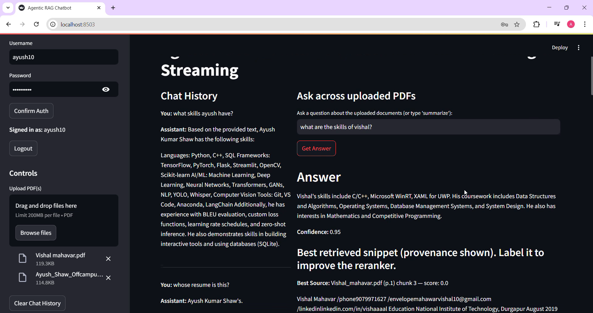
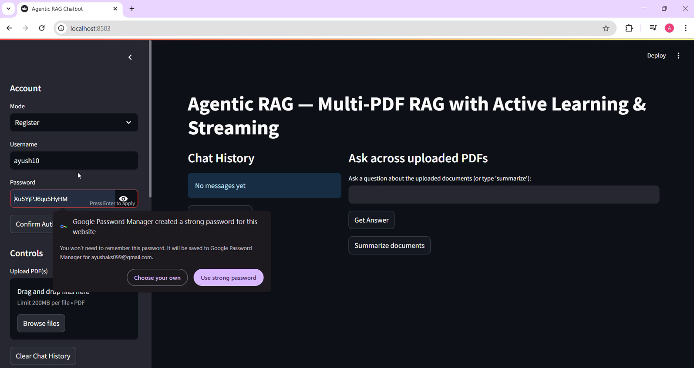
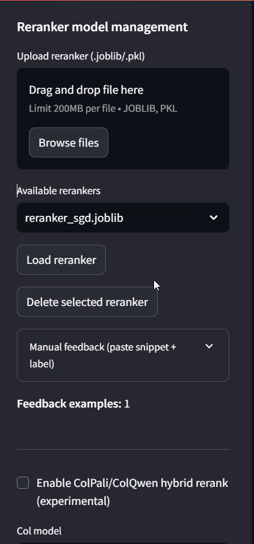
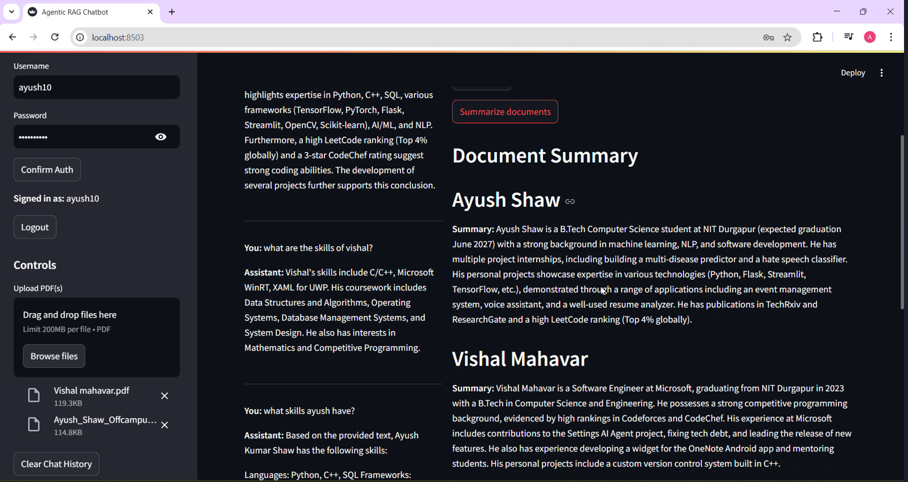

# ⚡ Agentic RAG — Multi‑PDF RAG Chatbot

[](LICENSE)    

<p align="center">
  <!-- Large, prominent demo button -->
  <a href="https://drive.google.com/file/d/1CkHzVcIQQrCE1JeM5Q8hdNra_4XG9uGm/view?usp=sharing" target="_blank">
    
  </a>
</p>

> **Agentic RAG** is a **production-ready Retrieval-Augmented Generation (RAG) platform** built with **Streamlit**. It supports **multi‑PDF ingestion**, **multi‑user authentication**, **active learning via feedback → incremental reranker training**, **hybrid ColPali/ColQwen visual reranking**, **persistent storage**, and **streaming LLM responses**.

---

## 🖼 Screenshots (embedded — moved here)

> All screenshots are displayed from the `Screenshots/` folder. Make sure these files are present in your repo at `Screenshots/Login.png`, `Screenshots/Rag_Chat1.png`, `Screenshots/Rag_Chat2.png`, `Screenshots/Reranker.png`, and `Screenshots/Summarization.png`.

### Key interface — RAG Chat (important: **Rag_Chat2** shown prominently)

<p align="center">
  
</p>

*Caption:* The main chat pane showing streamed answers, snippet provenance, and feedback buttons.

### Login screen

<p align="center">
  
</p>

### RAG Chat – alternate view

<p align="center">
  
</p>

### Reranker & Feedback UI

<p align="center">
  
</p>

### Summarization / Document Overview

<p align="center">
  
</p>

---

---

## 📚 Table of Contents

* [Why Agentic RAG](#-why-agentic-rag)
* [Feature Highlights](#-feature-highlights)
* [Architecture](#-architecture)
* [Prerequisites](#-prerequisites)
* [Environment Variables](#-environment-variables--env)
* [Installation](#-installation)
* [Run the App](#️-run-the-app)
* [Quickstart Workflow](#-quickstart-workflow)
* [Incremental Reranker Training](#-incremental-reranker-training)
* [ColPali/ColQwen Hybrid Rerank (Experimental)](#-colpalicolqwen-hybrid-rerank-experimental)
* [Security & Operations](#-security--operations)
* [UI Overview](#-ui-overview)
* [Screenshots](#-screenshots)
* [Troubleshooting](#-troubleshooting)
* [Roadmap](#-roadmap)
* [Contributing](#-contributing)
* [License](#-license)

---

## 💡 Why Agentic RAG

* 🔍 **Ask questions across many PDFs** in natural language.
* 👤 **Multi-user** accounts with per-user persistent storage (SQLite + file sandboxing).
* 🧠 **Active learning:** feedback buttons store labels and **incrementally train** a lightweight reranker (SGDClassifier).
* 🖼️ **Hybrid retrieval:** text + **ColPali/ColQwen** page-image similarity for visual documents.
* ⚡ **Streaming answers** + snippet‑level **confidence scoring** and provenance.
* 🌐 **Web search fallback** (Tavily) when document confidence is low.
* 🛡️ **Operational safety:** password hashing (PBKDF2), file sanitization, rate limiting, and export tools.

---

## ✨ Feature Highlights

(Condensed — full detail in repository)

* Register/login (SQLite `users` table), PBKDF2‑SHA256.
* Persisted chats and feedback per user.
* Multi‑PDF upload with OCR fallback.
* Chroma vector store, Gemini embeddings by default.
* Two‑stage reranker + hybrid visual rerank.
* Streaming LLM responses and provenance.

---

## 🖼 Screenshots (embedded)

> All screenshots are displayed from the `Screenshots/` folder. Make sure these files are present in your repo at `Screenshots/Login.png`, `Screenshots/Rag_Chat1.png`, `Screenshots/Rag_Chat2.png`, `Screenshots/Reranker.png`, and `Screenshots/Summarization.png`.

### Key interface — RAG Chat (important: **Rag_Chat2** shown prominently)

<p align="center">
  
</p>

*Caption:* The main chat pane showing streamed answers, snippet provenance, and feedback buttons.

### Login screen

<p align="center">
  
</p>

### RAG Chat – alternate view

<p align="center">
  
</p>

### Reranker & Feedback UI

<p align="center">
  
</p>

### Summarization / Document Overview

<p align="center">
  
</p>

---

## 🛠 Prerequisites

* **Python 3.8+**
* **Gemini API key** for default LLM & embeddings
* Optional extras: Tesseract, torch, pdf2image, scikit‑learn, joblib, tiktoken

---

## ⚙ Environment Variables / `.env`

Create a `.env` (or set env vars) with at least:

```env
GEMINI_API_KEY=your_gemini_key_here
TAVILY_API_KEY=your_tavily_key_here
AGENTIC_RAG_DB_PATH=./agentic_rag.db
AGENTIC_RAG_STORAGE=./storage_root
AGENTIC_RAG_MAX_UPLOAD_BYTES=10485760   # default 10 MB
AGENTIC_RAG_RATE_LIMIT_N=30
```

---

## 💻 Installation

```bash
python -m venv .venv
# activate
pip install -r requirements.txt
```

---

## ▶️ Run the App

```bash
streamlit run app.py
```

Open the URL shown in your terminal (usually `http://localhost:8501`).

---

## 🧭 Quickstart Workflow

1. Start: `streamlit run app.py`.
2. Register / Login in the sidebar.
3. Upload PDFs in the sidebar.
4. Ask a question or Summarize documents.
5. Provide feedback on snippets; train reranker to improve results.

---

## 🔁 Incremental Reranker Training

Feedback rows are stored; call `train_reranker_incremental(user_id)` or use the sidebar control to train/partial_fit the SGDClassifier.

---

## 🔒 Security & Operations

* PBKDF2 password hashing, sanitized filenames, rate limiting.
* For production: reverse proxy, TLS, DB volume protection, OAuth.

---

## 🧪 Troubleshooting

* Missing LLM key → set `GEMINI_API_KEY`.
* Chroma or storage issues → check `AGENTIC_RAG_STORAGE` permissions.
* OCR issues → install Tesseract and `pytesseract`.

---

## 🗺 Roadmap

* Modularize `app.py` into packages; add OAuth and k8s manifests; add unit tests.

---

## 🤝 Contributing

Open an issue or PR with a clear description.

---

## 📝 License

MIT — see `LICENSE`.

---

* If any screenshot filenames differ, update the paths above. GitHub will render the images automatically when `Screenshots/` exists in the repo.
* The demo link has been made visually prominent via a large centered badge at the top of this README.
