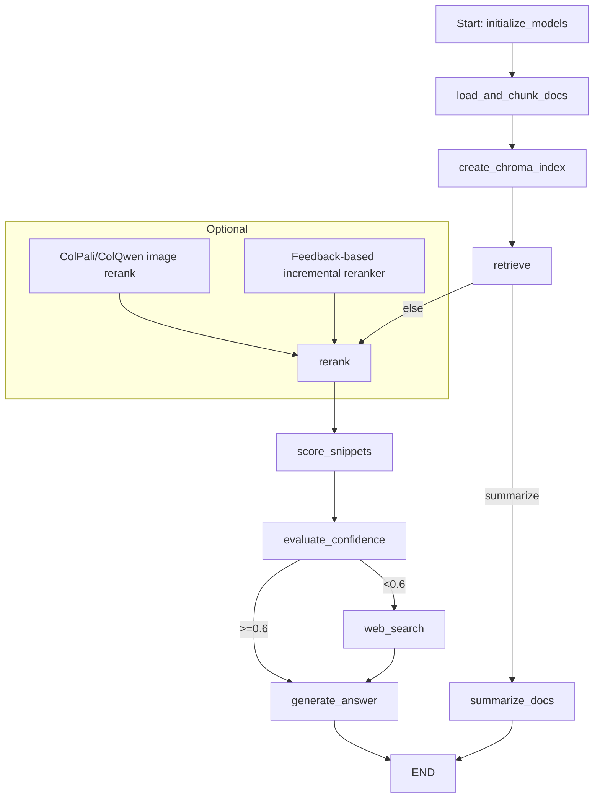
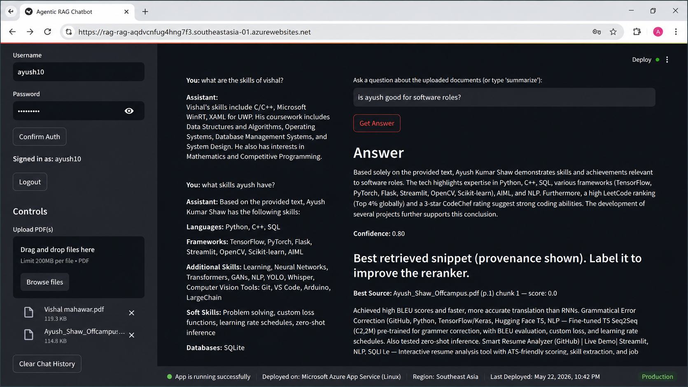
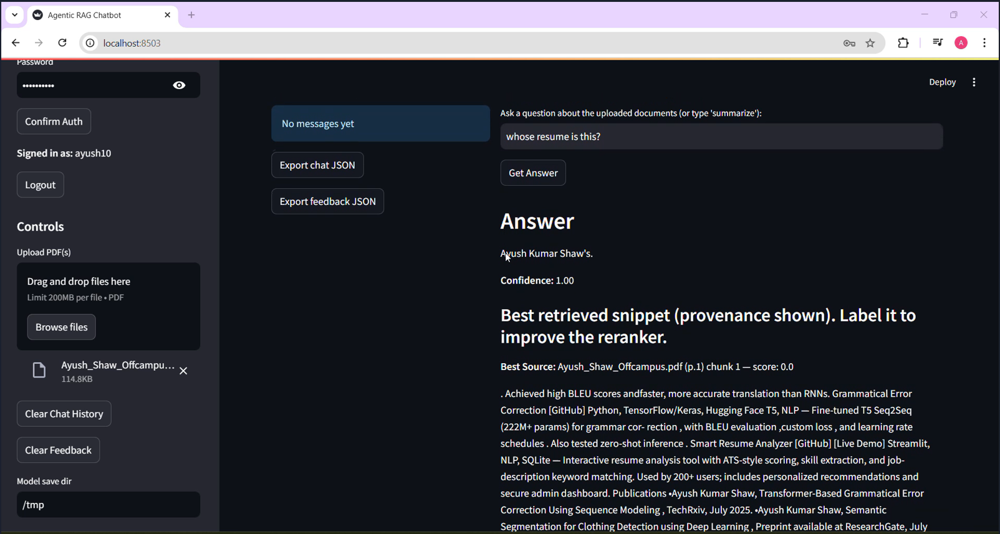
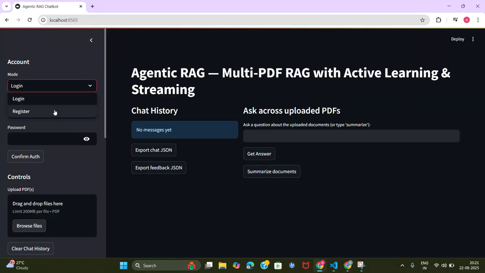
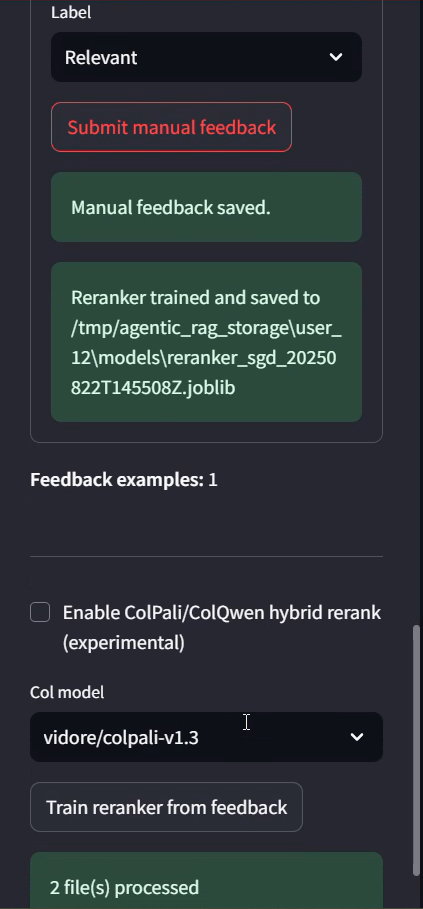

# ⚡ Agentic RAG — Multi‑PDF RAG Chatbot

[](LICENSE)      

> **Agentic RAG** is a **production-ready Retrieval-Augmented Generation (RAG) platform** built with **Streamlit**. It supports **multi‑PDF ingestion**, **multi‑user authentication**, **active learning via feedback → incremental reranker training**, **hybrid ColPali/ColQwen visual reranking**, **persistent storage**, **Docker deployment**, **Azure deployment**, and **streaming LLM responses**.

---

# 🎥 **LIVE DEMO — WATCH THE VIDEO**

<p align="center">
  <a href="https://drive.google.com/file/d/1CkHzVcIQQrCE1JeM5Q8hdNra_4XG9uGm/view?usp=sharing" target="_blank">
    
  </a>
</p>

> **(Click the big badge above to open the recorded live demo instantly.)**

---

## 📚 Table of Contents

* [Why Agentic RAG](#-why-agentic-rag)
* [Feature Highlights](#-feature-highlights)
* [Architecture](#-architecture)
* [Prerequisites](#-prerequisites)
* [Environment Variables](#-environment-variables--env)
* [Installation](#-installation)
* [Run the App](#️-run-the-app)
* [Docker Deployment](#-docker-deployment)
* [Azure Deployment](#-azure-deployment)
* [Quickstart Workflow](#-quickstart-workflow)
* [Incremental Reranker Training](#-incremental-reranker-training)
* [ColPali/ColQwen Hybrid Rerank (Experimental)](#-colpalicolqwen-hybrid-rerank-experimental)
* [Security & Operations](#-security--operations)
* [UI Overview](#-ui-overview)
* [Troubleshooting](#-troubleshooting)
* [Screenshots](#-screenshots)
* [Roadmap](#-roadmap)
* [Contributing](#-contributing)
* [License](#-license)

---

## 💡 Why Agentic RAG

* 🔍 **Ask questions across many PDFs** in natural language.
* 👤 **Multi-user** accounts with per-user persistent storage (SQLite + file sandboxing).
* 🧠 **Active learning:** feedback buttons store labels and **incrementally train** a lightweight reranker (SGDClassifier).
* 🖼️ **Hybrid retrieval:** text + **ColPali/ColQwen** page-image similarity for visual documents.
* ⚡ **Streaming answers** + snippet‑level **confidence scoring** and provenance.
* 🌐 **Web search fallback** (Tavily) when document confidence is low.
* 🐳 **Docker-ready** for portable deployments.
* ☁️ **Azure deployment-ready** with scalable infrastructure support.
* 🛡️ **Operational safety:** password hashing (PBKDF2), file sanitization, rate limiting, and export tools.

---

## ✨ Feature Highlights

### Authentication & Persistence

* Register/login (SQLite `users` table), PBKDF2‑SHA256 with per‑user salt.
* Persisted chats (`chats`) and feedback (`feedback`) per user.
* Per‑user file registry (`files`) with sanitized, content-hash filenames.

### Uploads & Ingestion

* Multi‑PDF upload via sidebar.
* Size guard via `AGENTIC_RAG_MAX_UPLOAD_BYTES` (default **10 MB**).
* Parsing with **PyPDF2**; OCR fallback (if **Tesseract + pytesseract** present).
* Token‑aware chunking via **tiktoken** (fallback to character chunking).

### Vector Index & Retrieval

* **Chroma** vector store, per user + file‑hash cache, optional disk persistence under `STORAGE_ROOT`.
* Embeddings via **GoogleGenerativeAIEmbeddings (Gemini)** (easily swappable).
* Configurable top‑k retrieval.

### Reranking & Active Learning

* Two-stage rerank:

  1. **Learned reranker** (SGDClassifier) trained incrementally on feedback.
  2. **Hybrid visual rerank** (ColPali/ColQwen page-image embeddings).
* Inline **Relevant / Not Relevant** feedback buttons.
* Incremental model persistence using `joblib`.

### LLM Orchestration & Scoring

* Primary LLM: **ChatGoogleGenerativeAI (Gemini)**.
* **score_snippets → evaluate → generate** pipeline.
* Streaming answers or chunked reveal fallback.

### Web Search Fallback

* Optional **Tavily** integration (`TAVILY_API_KEY`).

### Deployment & Operations

* 🐳 Dockerized deployment workflow.
* ☁️ Azure cloud deployment support.
* Persistent storage support for production.
* Environment-variable based configuration.

---

## 🧱 Architecture


```mermaid
flowchart TD
  A[Start: initialize_models] --> B[load_and_chunk_docs]
  B --> C[create_chroma_index]
  C --> D[retrieve]
  D -->|summarize| M[summarize_docs]
  D -->|else| E[rerank]
  E --> F[score_snippets]
  F --> G[evaluate_confidence]
  G -->|>=0.6| H[generate_answer]
  G -->|<0.6| I[web_search]
  I --> H
  H --> Z[END]
  M --> Z

  subgraph Optional
    I2[ColPali/ColQwen image rerank] --> E
    J[Feedback-based incremental reranker] --> E
  end
```

---

## 🛠 Prerequisites

* **Python 3.8+**
* **Gemini API key** for default LLM & embeddings
* Optional extras:

  * `pytesseract` + **Tesseract** binary for OCR
  * `torch`, `pdf2image`, `colpali_engine` for ColPali/ColQwen image embeddings
  * `scikit-learn` + `joblib` for reranker training
  * `tiktoken` for token‑accurate chunking
  * **Tavily API key** for web search fallback
  * **Docker Desktop** for container deployment

---

## ⚙ Environment Variables / `.env`

Create a `.env` (or set env vars) with at least:

```env
GEMINI_API_KEY=your_gemini_key_here
TAVILY_API_KEY=your_tavily_key_here
AGENTIC_RAG_DB_PATH=./agentic_rag.db
AGENTIC_RAG_STORAGE=./storage_root
AGENTIC_RAG_MAX_UPLOAD_BYTES=10485760
AGENTIC_RAG_RATE_LIMIT_N=30
```

> The app also reads `st.secrets` if present.

---

## 💻 Installation

```bash
# 1) Create and activate a virtual environment
python -m venv .venv

# mac/linux
source .venv/bin/activate

# windows
.venv\Scripts\activate

# 2) Install dependencies
pip install -r requirements.txt

# optional extras
pip install scikit-learn joblib tiktoken pytesseract pdf2image torch
```

---

## ▶️ Run the App

```bash
streamlit run app.py
```

Then open the URL shown in your terminal:

```bash
http://localhost:8501
```

---

## 🐳 Docker Deployment

This project supports Dockerized deployment for consistent local and cloud environments.

### Build the Docker Image

```bash
docker build -t agentic-rag .
```

### Run the Container

```bash
docker run -p 8501:8501 \
  --env-file .env \
  agentic-rag
```

### Access the Application

```bash
http://localhost:8501
```

### Optional Persistent Storage

```bash
docker run -p 8501:8501 \
  --env-file .env \
  -v $(pwd)/storage_root:/app/storage_root \
  agentic-rag
```

### Docker Notes

* Ensure `.env` contains valid API keys.
* Persistent volume mounting is recommended for production.
* Use HTTPS and a reverse proxy for internet-facing deployments.
* SQLite database and embedding caches can be persisted using mounted volumes.

---

## ☁️ Azure Deployment

The application is deployment-ready for Microsoft Azure.

### Recommended Azure Services

* **Azure App Service** → Simplest Streamlit deployment.
* **Azure Container Apps** → Recommended for Docker-based scaling.
* **Azure Virtual Machines** → Full infrastructure control.
* **Azure Container Registry (ACR)** → Store Docker images securely.

### Azure Deployment Workflow

1. Build the Docker image.
2. Push the image to Docker Hub or Azure Container Registry.
3. Create an Azure Web App or Container App.
4. Configure environment variables.
5. Deploy the container image.
6. Attach persistent storage if needed.

### Example Azure CLI Deployment

```bash
# Login
az login

# Create resource group
az group create --name agentic-rag-rg --location centralindia

# Create app service plan
az appservice plan create \
  --name agentic-rag-plan \
  --resource-group agentic-rag-rg \
  --is-linux

# Create web app
az webapp create \
  --resource-group agentic-rag-rg \
  --plan agentic-rag-plan \
  --name agentic-rag-app \
  --deployment-container-image-name agentic-rag:latest
```

### Configure Azure Environment Variables

```env
GEMINI_API_KEY=your_gemini_key_here
TAVILY_API_KEY=your_tavily_key_here
AGENTIC_RAG_DB_PATH=./agentic_rag.db
AGENTIC_RAG_STORAGE=./storage_root
AGENTIC_RAG_MAX_UPLOAD_BYTES=10485760
AGENTIC_RAG_RATE_LIMIT_N=30
```

### Azure Production Notes

* Use **Azure Key Vault** for secrets management.
* Enable HTTPS and secure networking.
* Mount persistent volumes for SQLite + embeddings.
* Consider PostgreSQL instead of SQLite for large-scale deployments.
* Enable autoscaling for production traffic.

---

## 🧭 Quickstart Workflow

1. Start the app: `streamlit run app.py`
2. Register an account and login.
3. Upload one or more PDFs.
4. Ask questions or summarize documents.
5. Read streamed answers with provenance.
6. Provide snippet feedback.
7. Train the reranker from feedback.

---

## 🔁 Incremental Reranker Training

* Feedback rows are stored per user in the `feedback` table.

* `train_reranker_incremental(user_id)` will:

  1. Load feedback rows.
  2. Embed snippet texts.
  3. Train or `partial_fit` an SGDClassifier.
  4. Persist models under `user_<id>/models/`.

* The UI exposes **Train reranker from feedback**.

---

## 🖼 ColPali/ColQwen Hybrid Rerank (Experimental)

* With `colpali_engine` + `torch` + `pdf2image` installed, the app computes page-image embeddings.
* Hybrid score blends image similarity and text relevance.
* Especially useful for diagram-heavy PDFs and tables.

---

## 🔒 Security & Operations

* Passwords hashed with **PBKDF2** + per-user salt.
* File writes confined under `STORAGE_ROOT`.
* Rate limiting support via `AGENTIC_RAG_RATE_LIMIT_N`.
* Docker and Azure compatible.
* Recommended production setup:

  * Reverse proxy
  * HTTPS/TLS
  * Persistent storage
  * Secret management
  * OAuth support

---

## 🧭 UI Overview

### Sidebar

* Register / Login
* Upload PDFs
* Model save directory
* Reranker controls
* Feedback tools
* Enable hybrid rerank
* Train reranker
* Summarize documents

### Main Pane

* Chat history
* Export tools
* Question input
* Streamed answers
* Provenance display
* Feedback buttons

---

## 🧪 Troubleshooting

* **LLM API key missing** → set `GEMINI_API_KEY`
* **Chroma errors** → verify permissions and storage paths
* **Reranker not training** → install `scikit-learn` + `joblib`
* **OCR not working** → install Tesseract + `pytesseract`
* **ColPali failures** → requires GPU-friendly dependencies
* **Docker issues** → verify mounted volumes and `.env`
* **Azure issues** → check container startup logs and environment variables

---

## 📸 Screenshots

### Azure Deployment / Cloud Setup



### Rag Chat — Main Chat View



### Login Screen



### Reranker / Feedback UI



> **Note:** These images are stored in the root directory of the repository.

---

## 🗺 Roadmap

* Modularize `app.py` into packages.
* OAuth2 / Google sign‑in.
* Kubernetes + Helm deployment.
* Unit tests and CI/CD.
* Advanced reranker analytics.
* PostgreSQL support for scale.
* Multi-model LLM orchestration.

---

## 🤝 Contributing

Contributions are welcome!

Please open an issue or pull request with:

* Clear description
* Reproduction steps
* Screenshots/logs if relevant

---

## 📝 License

This project is provided under the **MIT License**.

See [`LICENSE`](LICENSE) for details.

---
